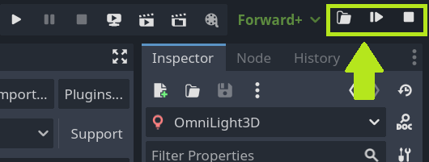
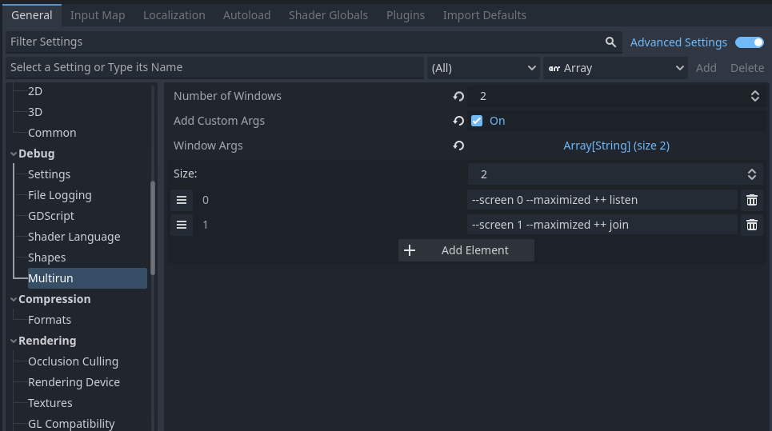

# Multirun

Multirun allows starting multiple game instances at once.

The main purpose of this feature is to speed up multiplayer game development. One game instance can be configured to host the game and others to join.

## How to use

1. Add the plugin to your project and enable it.
2. Configure the plugin in Project Settings. The settings are located under *Debug → Multirun*.
3. Run the script by clicking the multirun button on the top right corner of Godot editor, or press F4 on keyboard.

Extra: next to the multirun button there is also a new folder button that opens the `"user://"` path when clicked.

## Settings

Under the Project Settings there is a new category *Debug → Multirun* with the following parameters:
* **Number of Windows** - the total number of windows it opens.
* **Add Custom Args** - when checked, it will add the user defined command line arguments to the opened game instances.
* **Window Args** - An array of arguments sent to each window in order of definition.

## Additional Information

Finding problems in the code, open a ticket on [GitHub](https://github.com/cyraid/MultirunForGodot4/issues).

